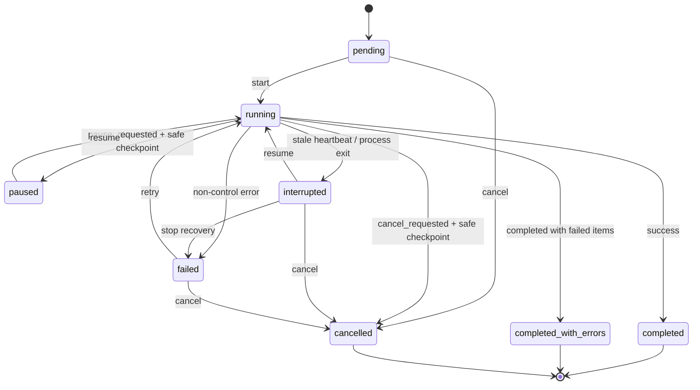

# Day 2 持久化任务状态机

`crawl_jobs` 是任务状态唯一数据源。Dashboard、CLI 和后台 runner 都通过 job repository 修改状态；不再依赖 dashboard 内存变量或向子进程 stdin 写入“继续”。

## 状态约束

- `pause` 和 `cancel` 先写请求标志，runner 只在安全批次边界执行状态切换。
- `heartbeat_at` 过期的 `running` 任务在服务启动时转为 `interrupted`，保留 `checkpoint_json`。
- `paused`、`interrupted` 和 `failed` 恢复时增加 `resume_count`。
- `completed`、`completed_with_errors`、`cancelled` 是终态，非法恢复会返回 `JOB_INVALID_TRANSITION`。
- `catalog`、`product_detail`、`reviews` 同时最多一个 `running`；`export` 和 `status` 不占浏览器锁。
- 人工验证产生 `manual_gate_waiting/manual_gate_paused` 事件；运营确认通过数据库将任务恢复为 `running`。

## Day 2 浏览器错误码

| 错误码 | 可重试 | 含义 |
|---|---:|---|
| `CHROME_NOT_FOUND` | 否 | 未找到配置或系统安装的 Google Chrome |
| `CDP_UNREACHABLE` | 是 | 本地 CDP 端口不可连接 |
| `NO_TEMU_PAGE` | 是 | 浏览器没有可用页面或 Temu 页面 |
| `WRONG_PAGE` | 是 | 当前可见页面不是 Temu |
| `CAPTCHA_OR_LOGIN` | 是 | 需要运营人工登录或完成验证码 |
| `NETWORK_ERROR` | 是 | 页面显示网络异常或连接超时 |
| `ACCESS_RESTRICTED` | 是 | 页面显示访问受限或异常流量 |
| `BROWSER_CLOSED` | 是 | Chrome、context 或 page 被关闭 |

程序不绕过验证码、不复制日常 Chrome profile，也不在事件或日志中保存 Cookie、Token 和会话数据。
